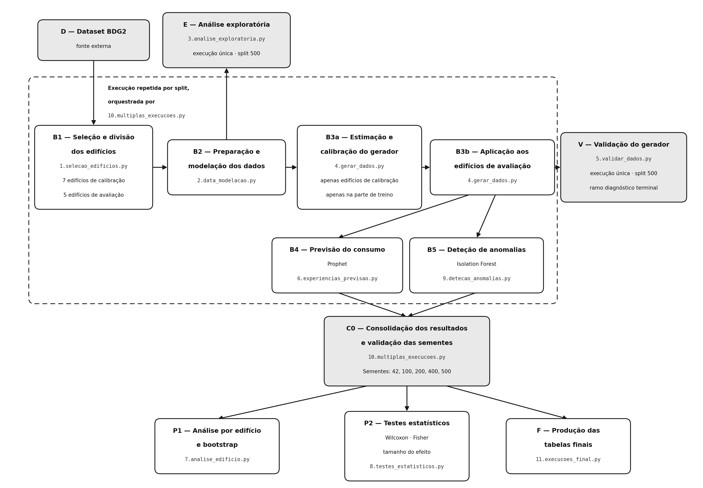

# Código da dissertação

Este repositório contém os scripts usados no pipeline experimental da dissertação **“Geração de Dados Sintéticos para Gestão Energética de Edifícios: Uma Abordagem Estatístico-Temporal para Data Augmentation”**.

O código prepara os dados do Building Data Genome Project 2 (BDG2), seleciona os edifícios usados em cada *split*, gera séries sintéticas e avalia o seu efeito em duas tarefas: previsão do consumo energético com Prophet e deteção de anomalias com Isolation Forest.

## Arquitetura do pipeline

<p align="center"></p>

O diagrama identifica o script responsável por cada etapa. O bloco tracejado
corresponde à sequência repetida em cada um dos cinco *splits*, orquestrada por
`10.multiplas_execucoes.py`.

## Estrutura esperada do projeto

Os comandos devem ser executados a partir da pasta principal do projeto, e não a partir da pasta `scripts/`. A estrutura mínima esperada é a seguinte:

```text
projeto/
├── data/
│   ├── electricity_cleaned.csv   (não incluído)
│   └── weather.csv
├── scripts/
│   ├── 1.selecao_edificios.py
│   ├── 2.data_modelacao.py
│   ├── 3.analise_exploratoria.py
│   ├── 4.gerar_dados.py
│   ├── 5.validar_dados.py
│   ├── 6.experiencias_previsao.py
│   ├── 7.analise_edificio.py
│   ├── 8.testes_estatisticos.py
│   ├── 9.detecao_anomalias.py
│   ├── 10.multiplas_execucoes.py
│   └── 11.execucoes_final.py
├── ficheiros_intermedios/
├── resultados/
├── resultados_verificacao/
└── figuras/
```

As pastas `ficheiros_intermedios/`, `resultados/` e `figuras/` são criadas pelos scripts quando necessário. A pasta `resultados_verificacao/` não é produzida pelo pipeline: acompanha o repositório e é descrita na secção «Resultados publicados».

## Dados de entrada

O pipeline usa dois ficheiros do BDG2:

* `data/electricity_cleaned.csv`: séries horárias de consumo, com uma coluna `timestamp` e uma coluna por edifício;
* `data/weather.csv`: dados meteorológicos, com as colunas `timestamp`, `site_id` e `airTemperature`.

Os identificadores dos edifícios devem manter o formato usado no BDG2, uma vez que o código utiliza esses identificadores para obter o *site* e a tipologia do edifício. A seleção é restringida aos edifícios da tipologia `education`.

A pasta `data/` inclui o `weather.csv`. O `electricity_cleaned.csv` não é distribuído aqui, porque tem 166,9 MiB e excede o limite de 100 MiB por ficheiro imposto pelo GitHub: tem de ser descarregado e colocado em `data/` antes da execução. O BDG2 é público e está disponível em https://github.com/buds-lab/building-data-genome-project-2.

## Dependências

Os scripts foram desenvolvidos em Python 3 e utilizam as seguintes bibliotecas:

* NumPy;
* pandas;
* Matplotlib;
* seaborn;
* SciPy;
* statsmodels;
* scikit-learn;
* Prophet.

As dependências podem ser instaladas com:

```bash
python -m pip install numpy pandas matplotlib seaborn scipy statsmodels scikit-learn prophet
```

As versões exatas das bibliotecas usadas na execução de verificação constam do ficheiro `versoes_ambiente.txt`, incluído na raiz do repositório. Para uma reprodução integral, devem ser usadas essas versões:

```bash
python -m pip install -r versoes_ambiente.txt
```


## Execução principal

A execução das experiências repetidas é controlada por:

```bash
python scripts/10.multiplas_execucoes.py
```

Este script percorre as sementes `42`, `100`, `200`, `400` e `500`. Em cada *split*, executa automaticamente:

1. `1.selecao_edificios.py`;
2. `2.data_modelacao.py`;
3. `4.gerar_dados.py`;
4. `6.experiencias_previsao.py`;
5. `9.detecao_anomalias.py`.

Os resultados de cada *split* são arquivados na pasta `resultados/`. No fim, o script cria os ficheiros consolidados usados nas análises por edifício, nos testes estatísticos e nas tabelas finais.

Como o último *split* usa a semente `500`, os ficheiros que permanecem em `ficheiros_intermedios/` no final da execução correspondem a esse *split*. São esses ficheiros que servem de base à análise exploratória e à validação do gerador apresentadas na dissertação.

## Geração das análises e resultados finais

Depois de concluir o script 10, executar os restantes scripts pela ordem seguinte:

```bash
python scripts/3.analise_exploratoria.py
python scripts/5.validar_dados.py
python scripts/7.analise_edificio.py
python scripts/8.testes_estatisticos.py
python scripts/11.execucoes_final.py
```

Esta sequência produz as estatísticas descritivas, a validação das séries sintéticas, a análise por edifício, os testes de Wilcoxon e Fisher e as tabelas e figuras finais usadas na dissertação.

## Função de cada script

### `1.selecao_edificios.py`

Carrega os dados de consumo, seleciona edifícios da tipologia educação e cria a divisão entre edifícios de calibração e de avaliação. Em cada *split* são selecionados sete edifícios de calibração e cinco de avaliação. O script também interpola lacunas curtas, até seis horas, e exclui séries que não cumprem os critérios de qualidade definidos.

Principais saídas:

* `ficheiros_intermedios/01_consumo_horario_edificios_educacao_selecionados.csv`;
* `ficheiros_intermedios/01_1_edificios_calibracao.csv`;
* `ficheiros_intermedios/01_2_edificios_teste.csv`.

### `2.data_modelacao.py`

Transforma os dados de consumo para formato longo e associa a temperatura exterior do respetivo *site*. Também produz ficheiros de diagnóstico sobre a cobertura meteorológica e a qualidade dos dados por edifício.

Principal saída:

* `ficheiros_intermedios/02_base_modelacao_consumo_e_temperatura.csv`.

### `3.analise_exploratoria.py`

Produz a análise descritiva das séries reais, incluindo a distribuição do consumo por edifício, exemplos de séries temporais e a relação entre temperatura exterior e consumo normalizado.

As estatísticas são guardadas em `ficheiros_intermedios/` e as figuras em `figuras/`.

### `4.gerar_dados.py`

Ajusta o gerador estatístico-temporal com os edifícios de calibração e gera séries sintéticas para os edifícios de avaliação. O gerador combina um perfil horário-semanal, uma componente térmica e uma componente residual AR(1).

Principais saídas:

* parâmetros estimados do gerador;
* séries sintéticas normalizadas por edifício, guardadas em `ficheiros_intermedios/`.

### `5.validar_dados.py`

Compara as séries reais e sintéticas do *split* 500. A validação inclui estatísticas descritivas, distribuição dos valores, perfis horário-semanais, autocorrelação e teste de Kolmogorov–Smirnov.

Os indicadores são guardados em ficheiros CSV e as representações gráficas em `figuras/`.

### `6.experiencias_previsao.py`

Avalia a previsão do consumo energético com Prophet. São comparados os cenários com 5%, 10% e 20% de histórico real, com e sem complemento sintético, e os cenários equivalentes com ruído branco. O cenário com 100% do histórico real é usado como referência.

Os resultados por edifício e os resumos de cada *split* são guardados em `resultados/`.

### `7.analise_edificio.py`

Analisa os resultados da previsão por edifício e por *split*. Calcula os ganhos de NRMSE no cenário de 20% de histórico real e aplica *bootstrap* às medianas obtidas nos cinco *splits*.

Produz tabelas em `resultados/` e figuras em `figuras/`.

### `8.testes_estatisticos.py`

Executa as comparações emparelhadas com o teste de Wilcoxon e combina os valores de prova dos cinco *splits* pelo método de Fisher. São analisadas as diferenças entre o treino apenas com histórico real, o complemento sintético e o controlo com ruído branco.

Os resultados dos testes são guardados em `resultados/` e as figuras em `figuras/`.

### `9.detecao_anomalias.py`

Avalia a deteção de anomalias com Isolation Forest. O teste é realizado com dados reais nos quais são introduzidas anomalias artificiais de aumento e redução. O desempenho é medido através de *precision*, *recall* e F1.

Os resultados por edifício e os resumos por cenário são guardados em `resultados/`.

### `10.multiplas_execucoes.py`

É o orquestrador principal do pipeline. Executa os scripts centrais para os cinco *splits*, arquiva as listas de edifícios e os resultados de cada execução e cria os ficheiros consolidados usados nas análises seguintes.

Este script deve ser executado antes dos scripts 7, 8 e 11.

### `11.execucoes_final.py`

Lê os resultados consolidados e produz as tabelas e figuras finais da previsão e da deteção de anomalias. Deve ser executado apenas depois da conclusão dos cinco *splits*.

## Ficheiros produzidos

O pipeline organiza os ficheiros em três pastas:

* `ficheiros_intermedios/`: bases preparadas, listas de edifícios, parâmetros do gerador e séries sintéticas;
* `resultados/`: métricas por edifício, resumos por cenário, resultados por *split*, testes estatísticos e tabelas consolidadas;
* `figuras/`: gráficos gerados pelos scripts de análise e consolidação.

Os ficheiros CSV produzidos pelo pipeline usam `;` como separador e `,` como separador decimal. As figuras são guardadas em formato PNG, geralmente com uma resolução de 300 dpi.

## Resultados publicados

O repositório inclui os resultados de duas execuções distintas do pipeline.

`resultados/` contém as saídas da execução que sustenta as tabelas e figuras do
corpo da dissertação e dos Apêndices A e C.

`resultados_verificacao/` contém as saídas da execução de verificação descrita na
Secção C.5 do Apêndice C, realizada numa máquina distinta e num ambiente instalado
de raiz. Inclui as duas análises de sensibilidade dessa secção — `06_2_*` para o
`changepoint_prior_scale` e `SENS_phi070*` e `SENS_phi095*` para o coeficiente de
persistência — e os ficheiros `04_1_parametros_gerador_sintetico_divisao<semente>.csv`,
que sustentam a tabela de parâmetros do gerador do Apêndice B e coincidem com os da
execução original, conforme a Secção C.5.1.

As diferenças de erro de previsão entre as duas execuções estão quantificadas na
Secção C.5. Cada comparação apresentada na dissertação envolve apenas cenários
obtidos na mesma execução. O ficheiro `versoes_ambiente.txt` documenta o ambiente
da execução de verificação.

Uma nova execução do pipeline reescreve `resultados/` e não altera
`resultados_verificacao/`.

## Reprodutibilidade

As divisões dos edifícios são controladas pelas sementes:

```text
42, 100, 200, 400 e 500
```

O script `10.multiplas_execucoes.py` define separadamente as sementes usadas na seleção dos edifícios, no gerador, na previsão e na deteção de anomalias. Esta separação evita que as diferentes componentes do pipeline partilhem inadvertidamente o mesmo estado aleatório.

Para repetir o estudo com a configuração usada na dissertação, não devem ser alteradas as sementes, os nomes dos ficheiros, a ordem dos scripts ou os parâmetros definidos no código.

## Execuções de sensibilidade

As execuções finais usam o `changepoint_prior_scale` no valor por defeito do
Prophet e o coeficiente de persistência da componente residual fixado em 0,85.
As duas análises de sensibilidade do Apêndice C reproduzem-se assim.

**changepoint_prior_scale (C.5.2):** definir `RUN_PROPHET_CPS05=1` antes de
executar `6.experiencias_previsao.py`. Os resultados são escritos em
`06_2_sensibilidade_prophet_cps_0_5_por_edificio.csv` e
`06_2_1_resumo_sensibilidade_prophet_cps_0_5.csv`, sem alterar os ficheiros
da execução principal.

```powershell
$env:RUN_PROPHET_CPS05="1"; python scripts/6.experiencias_previsao.py
```

**Coeficiente de persistência (C.5.3):** definir `AR1_PHI` com o valor 0.70 ou
0.95 antes de repetir o *pipeline* nos cinco *splits*. O valor tem de ser escrito
com ponto decimal. Sem esta variável, o gerador usa 0,85, o valor das execuções
finais.

```powershell
$env:AR1_PHI="0.70"; python scripts/10.multiplas_execucoes.py
```

## Notas de execução

* Executar os comandos a partir da pasta principal do projeto.
* Manter os scripts dentro da pasta `scripts/`, porque o orquestrador usa esse caminho.
* Confirmar que os dois ficheiros de entrada existem em `data/` antes de iniciar o pipeline.
* Fechar ficheiros CSV que estejam abertos no Excel ou noutro programa, para evitar bloqueios durante a escrita.
* Não editar manualmente os ficheiros de `ficheiros_intermedios/` ou `resultados/` entre *splits*.
* Se uma execução for interrompida, confirmar os ficheiros existentes antes de reutilizar resultados parciais.

## Sequência resumida

Para reproduzir os resultados finais a partir dos dados de entrada:

```bash
python scripts/10.multiplas_execucoes.py
python scripts/3.analise_exploratoria.py
python scripts/5.validar_dados.py
python scripts/7.analise_edificio.py
python scripts/8.testes_estatisticos.py
python scripts/11.execucoes_final.py
```
